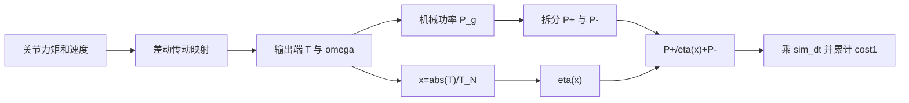

# 减速器非线性效率机械能模式实现说明

## 1. 模式定义

`reducer_corrected_8` 使用减速器输出端额定转矩比例计算正功效率，并把负功绝对值作为
正 cost（代价）加入。对第 $j$ 个电机通道：

$$
P_j^+=\max(P_{g,j},0),
\qquad
P_j^-=\max(-P_{g,j},0),
$$

$$
T_j=|T_{\mathrm{out},j}|,
\qquad
x_j=\frac{T_j}{T_{N,j}},
$$

$$
\eta(x_j)=\frac{0.905x_j}{x_j+0.2735},
$$

$$
P_{\mathrm{cost}}
=\sum_j\left(
\frac{P_j^+}{\eta(x_j)}+P_j^-
\right).
$$

每个物理子步的能量代价为：

$$
E_{\mathrm{cost,substep}}=P_{\mathrm{cost}}\,\Delta t.
$$

其中：

- $P_{g,j}=T_{\mathrm{out},j}\omega_{\mathrm{out},j}$：第 $j$ 个传动通道的机械功率。
- $T_{\mathrm{out},j}$：减速器输出端转矩，单位为 $\mathrm{N\,m}$。
- $T_{N,j}$：减速器输出端额定转矩，单位为 $\mathrm{N\,m}$。
- $x_j$：额定转矩比例，无量纲。
- $P_j^+$：正机械功率。
- $P_j^-$：负机械功率的绝对值，是非负量。

## 2. 正功和负功的处理

### 2.1 正功

当 $P_{g,j}>0$ 时，电机处于正向驱动区域。代码先用输出端转矩幅值计算额定转矩比例
$x_j$，再计算效率：

$$
\eta_j=\frac{0.905x_j}{x_j+0.2735}.
$$

正功输入侧成本为：

$$
P_{\mathrm{cost},j}^+=\frac{P_j^+}{\eta_j}.
$$

该效率函数满足：

- $x_j\rightarrow0$ 时，$\eta_j\rightarrow0$。
- $x_j$ 增大时，效率逐渐上升。
- $x_j\rightarrow\infty$ 时，$\eta_j\rightarrow0.905$。
- 效率不会超过 $0.905$。

### 2.2 零正功

当 $P_j^+=0$ 时，数学表达式可能出现 $0/0$。实现明确规定：

$$
P_j^+=0
\quad\Longrightarrow\quad
P_{\mathrm{cost},j}^+=0.
$$

代码通过正功掩码和安全的额定转矩比例避免产生 `NaN`（非数值）。

### 2.3 负功

负功效率固定为 1，负功绝对值直接作为正成本加入：

$$
P_{\mathrm{cost},j}^-=P_j^-.
$$

因此该模式不考虑能量回收，不会用负功抵消正功，并且每个电机、每个物理子步的成本
均为非负值。

## 3. 与旧定义的区别

被覆盖的旧定义是：

$$
E_m=\sum_j\left(
\frac{E_{g,j}^+}{\eta_{g,\mathrm{mot},j}}
-\eta_{g,\mathrm{gen},j}E_{g,j}^-
\right).
$$

新定义有三项根本变化：

1. 正功效率不再是固定输入参数，而由 $x_j=|T_j|/T_{N,j}$ 动态计算。
2. 负功系数固定为 1，并使用加号。
3. 新成本始终非负，不再存在负功回收导致的负 cost。

由于旧模式尚未用于正式训练，本次直接保留模式名称 `reducer_corrected_8` 并覆盖其语义。
已有旧提交中的示例命令和结果目录不能再与新定义混用。

## 4. BRUCE 的 8 电机传动映射

BRUCE 有 10 个腿部自由度。本模式使用 8 个耦合传动电机通道，不包含两个髋部偏航舵机：

```text
忽略：hip_yaw_r、hip_yaw_l
纳入：两侧 hip_pitch、hip_roll、knee_pitch、ankle_pitch
```

代码通过差动传动矩阵把关节力矩和速度映射到减速器输出端：

$$
\boldsymbol{\omega}_{\mathrm{out}}
=\boldsymbol{\omega}_{\mathrm{joint}}(J^{-1})^{\mathsf T},
\qquad
\boldsymbol{T}_{\mathrm{out}}
=\boldsymbol{\tau}_{\mathrm{joint}}J.
$$

随后计算每个输出端通道的机械功率：

$$
P_{g,j}=T_{\mathrm{out},j}\omega_{\mathrm{out},j}.
$$

默认右侧自由度在前时，8 个额定转矩参数依次对应：

1. `right_hip_motor_0`
2. `right_hip_motor_1`
3. `right_lower_motor_0`
4. `right_lower_motor_1`
5. `left_hip_motor_0`
6. `left_hip_motor_1`
7. `left_lower_motor_0`
8. `left_lower_motor_1`

代码也支持左侧自由度在前的模型。传入 8 个值时，参数顺序必须与运行时电机顺序一致。

## 5. 额定转矩参数

启用该模式时必须显式提供：

```bash
--reducer_rated_torque=<输出端额定转矩T_N>
```

如果 8 个电机使用同一个额定转矩，可以传一个值：

```bash
--reducer_rated_torque=12.0
```

如果额定转矩不同，可以按运行时顺序传入 8 个值：

```bash
--reducer_rated_torque=12,12,10,10,12,12,10,10
```

以上数值仅用于展示参数格式，不代表 BRUCE 的真实额定转矩。

参数校验规则：

- 只能传 1 个值或 8 个值。
- 每个值必须有限且严格大于 0。
- 参数单位必须是减速器输出端的 $\mathrm{N\,m}$。
- 不允许直接使用电机转子侧额定转矩，除非已经按减速比换算到输出端。
- 不应把 URDF（统一机器人描述格式）中的最大力矩限制直接当作额定转矩，除非硬件资料明确说明二者相同。

仓库目前没有提供可信的 $T_N$ 实测值，因此代码不会设置猜测默认值。

## 6. 代码数据流



每个物理子步的等价 Python（编程语言）逻辑是：

```python
positive_power = clamp(rotor_power, min=0.0)
negative_power = clamp(-rotor_power, min=0.0)
x = abs(output_torque) / rated_torque
eta = 0.905 * x / (x + 0.2735)
positive_cost = where(positive_power > 0.0, positive_power / eta, 0.0)
cost_energy = (positive_cost + negative_power) * sim_dt
```

实际代码使用代数等价的安全形式，避免零功率处出现 $0/0$。

主要实现位置：

- `bruce_gym/rotor_energy.py`
  - `reducer_positive_efficiency()`：计算 $\eta(x)$。
  - `compute_reducer_corrected_energy_per_motor()`：计算逐电机子步能量。
  - `compute_bruce_energy_terms()`：生成传动功率及新模式成本。
  - `energy_cost_from_terms()`：选择训练使用的成本。
- `bruce_gym/envs/base/legged_robot.py`
  - 创建和校验 $T_N$ 张量。
  - 逐物理子步累计成本。
- `bruce_gym/scripts/calibrate_train_cost.py`
  - 计算完整回合成本并重新标定约束上限。
- `bruce_gym/scripts/evaluate_energy.py`
  - 输出逐步、逐回合和步态阶段结果。

## 7. 输出和命名

评估及标定元数据记录：

- `energy_cost_mode = reducer_corrected_8`
- `reducer_rated_torque`
- `reducer_positive_efficiency_scale = 0.905`
- `reducer_positive_efficiency_offset = 0.2735`
- `reducer_efficiency_input = abs(output_torque) / rated_torque`
- `reducer_negative_power_efficiency = 1.0`
- `rotor_names`：记录 8 个额定转矩值对应的运行时电机顺序。

结果包含：

- `reducer_corrected_energy_8`
- `e_reducer_corrected_per_m`
- 原始正机械能和负机械能，用于交叉检查。

模式缩写仍为 `rc8`。统一额定转矩会生成例如 `tn12p5` 的目录后缀；逐电机参数使用
稳定哈希，防止不同 $T_N$ 配置覆盖彼此。

## 8. 训练影响

新定义改变了 `cost1` 的数值和梯度反馈目标，后续训练得到的模型权重也会改变。
旧模式或其他能耗模式的 `cost_limit1` 不能复用。

正式训练前必须：

1. 确认真实的输出端额定转矩 $T_N$。
2. 使用原始策略在训练分布下重新标定成本。
3. 检查成本均值、成功率、跌倒率和单位距离成本。
4. 使用新标定的 `cost_limit1` 训练。
5. 在相同速度、地形、种子和回合数下进行训练前后比较。

完整命令见 `减速器修正机械能训练说明.md`。

## 9. 测试覆盖

单元测试覆盖：

- $x=|T|/T_N$ 的效率计算。
- 正功除以非线性效率。
- 负功绝对值以系数 1 加入。
- 零正功不会产生 `NaN`。
- 成本始终非负。
- 统一额定转矩和 8 电机额定转矩解析。
- 缺失、非正或数量错误的额定转矩会被拒绝。
- 训练成本、标定重建和评估汇总使用同一口径。

本模式不包含电机铜耗、铁耗、驱动器损耗、电池效率或能量回收模型。
